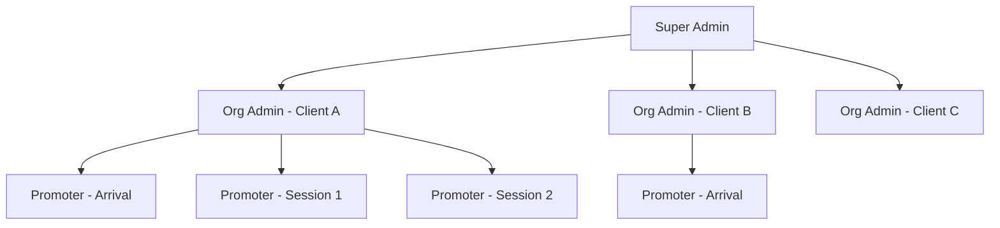

# 🌍 TravelConnect — Pitch Deck
### The All-in-One SaaS Platform for Corporate Travel & Event Management

---

## 🎯 The Problem

Corporate travel and incentive programs involve **dozens of disconnected tools** — spreadsheets for guest lists, separate email marketing platforms, manual check-ins, no real-time engagement tracking, and zero gamification. Event organizers waste **40+ hours** per event on logistics that should be automated.

> [!CAUTION]
> Traditional event management tools are **generic**. They don't understand the unique needs of corporate travel programs, dealer meets, incentive trips, and team off-sites.

---

## 💡 The Solution — TravelConnect

A **white-label, multi-organization SaaS platform** purpose-built for corporate travel & event companies. Every client gets their own branded micro-site with a full CMS, guest management, live engagement tools, and on-ground operations — all in one place.

---

## 🏆 Unique Selling Propositions (USPs)

### 1. 🏢 Multi-Organization White-Label Architecture
- Each client org gets a **branded subdomain** (`client-slug.yourplatform.com`)
- Custom **logo, header/footer colors, and button themes** per organization
- Fully isolated data — one platform, infinite organizations
- **Super Admin** oversight across all orgs from a single dashboard

> This is not just an event tool — it's a **platform-as-a-service** for travel & event companies managing multiple clients.

### 2. 📱 Built-In CMS — No Designers Required
6 fully editable **public-facing pages** per organization, managed through a visual editor:

| Page | What It Powers |
|------|---------------|
| **Home** | Hero banner, countdown timer, about section, info cards |
| **Agenda** | Multi-day itineraries with sessions, dress codes, locations, images |
| **Venue** | Hotel details, maps (Google + Apple), inclusions/exclusions |
| **Gallery** | S3-powered media gallery with lazy loading |
| **FAQ** | Accordion-style Q&A |
| **FunZone** | Interactive activities & mini-games |

- **Draft → Publish workflow** with version tracking
- No code changes needed — admins update content visually and hit **Publish**

### 3. 🎮 Gamification & Engagement Engine
The **#1 differentiator** from a marketing and promo perspective:

- **Bonus Code System** — Scatter redeemable codes at event venues, in emails, on promo materials. Guests scan/enter codes to earn points
- **Real-Time Leaderboard** — Live scoreboard with avatars, rankings, and point history
- **Score Tracking** — Points from `BONUS_CODE`, `ACTIVITY_WIN`, and custom sources
- **Anti-Fraud** — Each code tracks `redeemed_by` to prevent double usage

> **Marketing Power:** Bonus codes turn passive attendees into active participants. Print them on table tents, hide them in venue locations, or distribute via push notifications. The leaderboard creates **social competition** that drives engagement throughout the event.

### 4. 📷 QR-Based On-Ground Operations
- Every registered guest gets an **auto-generated QR code** (stored on S3)
- **Promoter Scanner App** — Dedicated login for on-ground staff with role-based scanners:

| Scanner Type | Use Case |
|-------------|----------|
| `ARRIVAL_SCANNER` | Airport/venue check-in |
| `SESSION_1` to `SESSION_9` | Track attendance per session |

- **Real-time status flags** — Track each guest's journey: `on_airport` → `on_bus` → `at_hotel` → `session_1` → `session_2`...
- Instant visibility for admins on who's where, in real-time

> **Promo Angle:** "Know exactly where every guest is at any moment. No clipboards. No spreadsheets. Just scan."

### 5. 📧 Multi-Channel Communication Suite

| Channel | Features |
|---------|----------|
| **Bulk Email** | HTML email composer, recipient targeting, CC/BCC, delivery tracking (success/failed per recipient) |
| **Push Notifications** | In-app notification bell with real-time updates |
| **Helpdesk Chat** | Two-way messaging between guests and admin |

- Full **campaign analytics** — see which emails bounced, who received, export reports
- **Email Invitation Tracking** — monitor unregistered invitees vs registered guests

### 6. 🧾 Guest Management & Document Vault
- **Configurable registration fields** per organization (name, email, gender, food preference, passport, govt ID, etc.)
- **Document uploads** — Passport, Government ID stored securely on S3
- **Booking management** — Flight, train, bus, cab, hotel tickets attached per guest
- **Govt ID uploads** with download capability for admin
- **CSV export** for all data

### 7. 🔐 Three-Tier Role Hierarchy

| Role | Access |
|------|--------|
| **Super Admin** | Manage all organizations, admins, users, and promoters globally |
| **Org Admin** | Full control over their organization's content, users, emails, and promoters |
| **Promoter** | QR scanner access only — scoped to their assigned station |

---

## 📊 Key Differentiators vs. Competitors

| Feature | TravelConnect | Cvent | Eventbrite | Generic CMS |
|---------|:---:|:---:|:---:|:---:|
| Multi-org white-label | ✅ | ❌ | ❌ | ❌ |
| Built-in CMS per org | ✅ | Partial | ❌ | ✅ |
| Gamification engine | ✅ | ❌ | ❌ | ❌ |
| QR scanner with roles | ✅ | ✅ | ❌ | ❌ |
| Bonus code system | ✅ | ❌ | ❌ | ❌ |
| In-app helpdesk chat | ✅ | ❌ | ❌ | ❌ |
| Bulk email + tracking | ✅ | ✅ | ✅ | ❌ |
| Guest document vault | ✅ | Partial | ❌ | ❌ |
| Configurable reg fields | ✅ | ✅ | Partial | ❌ |
| Real-time attendance | ✅ | Partial | ❌ | ❌ |

---

## 🎯 Target Market

### Primary
- **Corporate travel & incentive companies** managing dealer meets, reward trips, and conferences
- **MICE (Meetings, Incentives, Conferences, Exhibitions)** agencies

### Secondary
- **HR departments** organizing team off-sites and retreats
- **Pharma companies** running HCP engagement programs
- **Automotive manufacturers** hosting dealer conferences

---

## 💰 Revenue Model

| Tier | Features | Pricing |
|------|----------|---------|
| **Starter** | 1 org, up to 200 guests, basic CMS | Per-event |
| **Professional** | Multi-org, gamification, scanner, bulk email | Monthly subscription |
| **Enterprise** | Unlimited orgs, white-label, API access, priority support | Annual contract |

---

## 🚀 Marketing & Promo Highlights

### For Sales Pitches:
> *"Give your guests a **mobile-first experience** with a branded micro-site, live leaderboard, and QR check-in — all set up in under 30 minutes."*

### For Social Media:
> *"Turn your corporate trips from logistics nightmares into **gamified experiences**. Bonus codes, leaderboards, and real-time tracking — all in one platform."*

### For Demo Days:
1. Create a new organization in 2 clicks
2. Customize the branded landing page
3. Import a guest list via email invitations
4. Scatter bonus codes, show the live leaderboard
5. Demo the QR scanner on a phone — scan and watch status update in real-time

---

## 🛠️ Tech Stack

| Layer | Technology |
|-------|-----------|
| Frontend | React + Vite, Redux Toolkit (RTK Query), TailwindCSS |
| Backend | Node.js + Express, MongoDB + Mongoose |
| Storage | AWS S3 (documents, QR codes, gallery media) |
| Real-time | Socket.io (notifications, helpdesk chat) |
| Auth | JWT with role-based middleware |

---

## 📈 Traction & Roadmap

### Built & Shipped ✅
- Multi-org architecture with Super Admin
- Full CMS with 6 page types and visual editors
- Gamification (bonus codes, leaderboard, score history)
- QR scanner with 10 station types
- Bulk email with tracking & reporting
- Push notifications
- Helpdesk messaging
- Guest document management
- Gallery with S3 integration

### Roadmap 🔜
- Mobile app (React Native) with offline QR scanning
- Payment integration for premium experiences
- AI-powered attendee insights & recommendations
- WhatsApp Business API integration
- Multi-language support
- Advanced analytics dashboard with charts

---

> [!TIP]
> **The pitch in one line:** *TravelConnect is the Shopify of corporate travel — a multi-tenant platform where each client gets a fully branded, gamified event experience without touching a line of code.*
